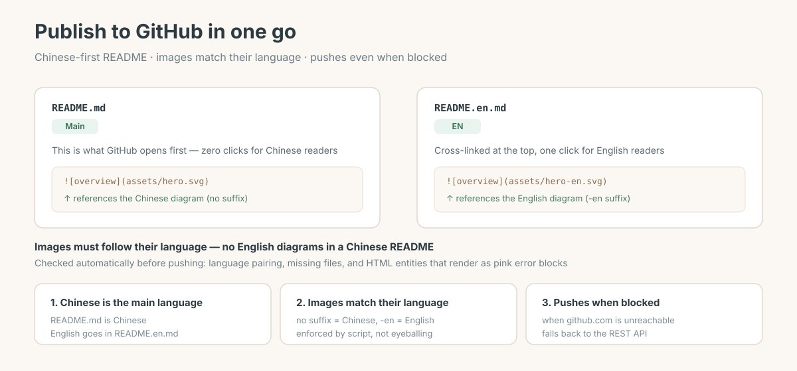

# GitHub Release

[中文](./README.md)

**Publish a local project to GitHub — Chinese-first README, images that match their language, pushes even when GitHub is blocked.**



## Sound familiar?

You're ready to ship a repo, and then:

- English README or Chinese? English feels like the default, but you and your readers are Chinese — they land on a wall of English
- You finally go bilingual, and **the Chinese README has English diagrams in it** — readers have to cross a language barrier to read a picture
- `git push` hangs. `github.com` won't connect. No idea if there's a way around it
- You push, then notice an image didn't render, or a renamed file is still sitting on the remote

This skill pins all of that down up front.

## What you get

**1. Chinese is the main language**

GitHub opens straight into a Chinese `README.md`. Zero clicks for Chinese readers. English lives in `README.en.md`, cross-linked at the top.

**2. Images must match their language**

| Filename | What goes there |
|---|---|
| `hero.svg` | Chinese diagram |
| `hero-en.svg` | English diagram |

The Chinese README references `hero.svg`; the English README references `hero-en.svg`. **An English diagram inside a Chinese README is a bug.**

Checked by script before you push, not by eyeballing:

```
README.md      [中文]  should reference no-suffix images
   ✓ assets/hero.svg
README.en.md   [English]  should reference -en images
   ✓ assets/hero-en.svg

✓ all pairs correct
```

**3. Pushes when GitHub is blocked**

Diagnose first:

```
github.com: 000        ← times out (blocked)
api.github.com: 200    ← reachable
```

That combination automatically switches to the GitHub REST API, **bypassing the blocked git transport entirely**. It also explains why your local and remote SHAs end up different.

**4. Catches a whole class of invisible bugs**

The checker also looks for HTML entities (like `&rarr;`) inside SVGs. **SVG is XML, so those render as pink error blocks in Chrome** — and ordinary text checks never notice.

```
✗ assets/hero.svg has problems:
   · HTML entity &rarr; is illegal in XML/SVG → use the literal character
   · unescaped & on line 4 → use &amp;
```

## When to use it

- Publishing a new repo and want the language and image rules right from the start
- An existing repo with mixed-language READMEs and mismatched images
- `git push` won't go through and you need a way around
- Standardising README style across a team

**It doesn't draw diagrams** — that's [`svg-infographic`](https://github.com/MoeWang-ys/svg-infographic)'s job.

## Install

```bash
mkdir -p ~/.pi/agent/skills/github-release
cp -r SKILL.md scripts references ~/.pi/agent/skills/github-release/
```

## Usage

Normal push:

```bash
git push -u origin main
```

When GitHub is blocked (`github.com` times out, `api.github.com` works):

```bash
export GITHUB_TOKEN=ghp_xxx
python3 scripts/push_via_api.py <owner>/<repo> README.md README.en.md \
  assets/hero.svg assets/hero-en.svg -m "docs: bilingual README"
```

Deleting files (the API only adds — after a rename you must clean up):

```bash
python3 scripts/push_via_api.py <owner>/<repo> --delete README.zh.md -m "remove old file"
```

Check image pairing before pushing:

```bash
python3 scripts/check_readme_assets.py .
```

## What's in here

```
SKILL.md                          publishing rules (language / image pairing / README style / push)
scripts/
  check_readme_assets.py          language pairing + broken images + SVG content
  push_via_api.py                 REST API fallback when github.com is blocked
references/
  USAGE.md                        usage and FAQ
assets/                           example diagrams
```

## README writing style (also fixed)

Follows [zarazhangrui](https://github.com/zarazhangrui). The order is not negotiable:

```
1. One line: what this is + who it's for      ← no tech stack names
2. Effect: lead with a diagram / result        ← what you get, not how it was built
3. Problem: name the reader's pain             ← your loss, not the author's struggle
4. How to use: shortest path in                ← three steps or fewer
5. How it works / pitfalls                     ← last, or link out
```

Keep it **under 150 lines**. No tech stack names up front. Never narrate the author's suffering.

## License

MIT
