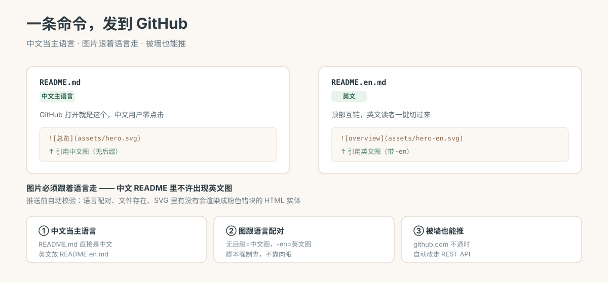

# GitHub Release

[English](./README.en.md)

**把本地项目发到 GitHub —— 中文当主语言，图片跟着语言走，被墙也能推。**



## 你有没有遇到过这种事

仓库要发布了，卡在这些破事上：

- README 写英文还是中文？英文吧，可你自己是中文用户，中文读者点进来看到一堆英文
- 好不容易做了中英双语，**结果中文 README 里插的是英文图** —— 读者要跨一道语言
- `git push` 卡死不动，`github.com` 连不上，不知道能不能绕过去
- 推完了发现有张图没渲染出来，或者改了名旧的还挂在线上

这个 skill 把这几件事一次性定死。

## 装上之后

**① 中文当主语言**

GitHub 打开就是一个中文 `README.md`，中文读者零点击。英文放 `README.en.md`，顶部互链。

**② 图片必须跟着语言走**

| 文件名 | 放什么图 |
|---|---|
| `hero.svg` | 中文图 |
| `hero-en.svg` | 英文图 |

中文 README 引用 `hero.svg`，英文 README 引用 `hero-en.svg`。**中文 README 里出现英文图 = 错误。**

推送前脚本自动查，不靠肉眼：

```
README.md      [中文]  应引用 无后缀图
   ✓ assets/hero.svg
README.en.md   [英文]  应引用 -en 图
   ✓ assets/hero-en.svg

✓ 全部配对正确
```

**③ 被墙也能推**

先诊断：

```
github.com: 000        ← 超时（被墙）
api.github.com: 200    ← 通
```

这种情况自动改走 GitHub REST API，**完全绕开被卡的 git 传输协议**。推完还告诉你本地和线上 SHA 为什么会不一样。

**④ 顺手拦掉一类隐形坑**

校验时会查 SVG 里有没有 HTML 实体（`&rarr;` 这种）。**SVG 是 XML，这类实体会让 Chrome 渲染成粉色错块** —— 而普通的文本检测完全抓不到。

```
✗ assets/hero.svg 内容有问题:
   · HTML 实体 &rarr; 在 XML/SVG 里非法 → 改用真实字符
   · 第 4 行有未转义的 & → 用 &amp;
```

## 什么时候用它

- 要发布一个新仓库，想一开始就把语言和图片规范定对
- 已有仓库的 README 语言乱、图片错配
- `git push` 推不上去，需要绕路
- 想统一团队的 README 风格

**造图不归它管** —— 那交给 [`svg-infographic`](https://github.com/MoeWangG/svg-infographic)。

## 怎么装

```bash
mkdir -p ~/.pi/agent/skills/github-release
cp -r SKILL.md scripts references ~/.pi/agent/skills/github-release/
```

## 怎么用

正常推送：

```bash
git push -u origin main
```

被墙时（`github.com` 超时、`api.github.com` 通）：

```bash
export GITHUB_TOKEN=ghp_xxx
python3 scripts/push_via_api.py <owner>/<repo> README.md README.en.md \
  assets/hero.svg assets/hero-en.svg -m "docs: bilingual README"
```

删除文件（API 只增不删，改名后要手动清）：

```bash
python3 scripts/push_via_api.py <owner>/<repo> --delete README.zh.md -m "remove old file"
```

推送前校验图片：

```bash
python3 scripts/check_readme_assets.py .
```

## 仓库里有什么

```
SKILL.md                          发布规范（语言策略 / 图片配对 / README 风格 / 推送）
scripts/
  check_readme_assets.py          校验语言配对 + 断图 + SVG 内容
  push_via_api.py                 github.com 不通时走 REST API
references/
  USAGE.md                        用法与常见问题
assets/                           示例图
```

## README 行文风格（也固化了）

参照 [zarazhangrui](https://github.com/zarazhangrui)，顺序不能变：

```
① 一句话：这是什么 + 给谁用     ← 不出现技术栈名
② 效果：直接上图 / 上结果         ← 说"你能拿到什么"
③ 问题：戳中读者的处境           ← 讲你的损失，不讲我的辛苦
④ 怎么用：最短上手路径           ← 3 步以内
⑤ 原理 / 踩坑                    ← 放最后，或外链出去
```

篇幅 **≤150 行**。开篇不许出现技术栈名，全文不许讲作者辛苦。

## 许可

MIT
